# 🛡️ Web Attack Detection Lab (Análisis de Incidente SOC)

## 📌 Descripción General

Este laboratorio simula un escenario real de un **Security Operations Center (SOC)**, donde se analiza tráfico malicioso dirigido a un servidor web Apache.

El enfoque principal no es el ataque en sí, sino la **detección, análisis, correlación y respuesta ante actividad sospechosa**, utilizando como fuente principal los logs del sistema.

---

## 🎯 Objetivos

- Monitorizar tráfico HTTP en tiempo real
- Detectar patrones de comportamiento malicioso
- Identificar intentos de explotación web
- Correlacionar eventos en una línea temporal
- Aplicar medidas de contención

---

## 🧱 Entorno

| Componente | Función |
|----------|--------|
| Ubuntu Server | Servidor web (Apache2) + fuente de logs |
| Kali Linux | Generador de tráfico (simulación de atacante) |

---

## ⚙️ 1. Configuración del Sistema

Se despliega y verifica el servicio Apache en el servidor Ubuntu.

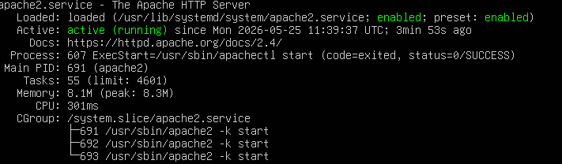

---

## 🌐 2. Configuración de Red

Se obtiene la dirección IP del servidor para permitir la comunicación con la máquina atacante.

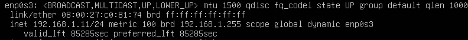

---

## 🌍 3. Validación de Acceso Web

Se comprueba que el servidor es accesible desde Kali mediante navegador.

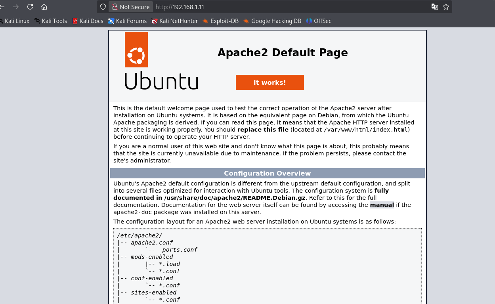

---

## 📂 4. Validación de Endpoints

Se crean y validan distintos endpoints web:

- `/admin`  
- `/login`  
- `/test`  

Esto simula una superficie de ataque real.


---

## 🔍 5. Generación de Tráfico

Se generan peticiones HTTP manuales desde Kali utilizando `curl`.

Esto permite simular tráfico inicial de reconocimiento.

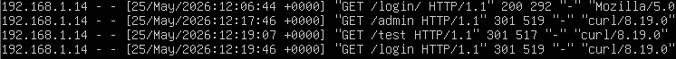

---

# 📡 6. Fase de Detección (SOC)

## 🔵 Monitorización en Tiempo Real

Se monitoriza el archivo de logs del servidor Apache:

```bash
tail -f /var/log/apache2/access.log
```

Esto permite observar en directo todas las peticiones entrantes.

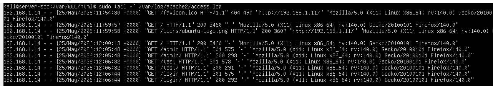

---

## 🟡 Detección de Fuzzing

Se identifica un alto volumen de peticiones a múltiples rutas inexistentes.

Indicadores clave:

- Muchas requests en poco tiempo
- Rutas aleatorias o comunes (`/admin`, `/phpmyadmin`, etc.)
- User-Agent automatizado

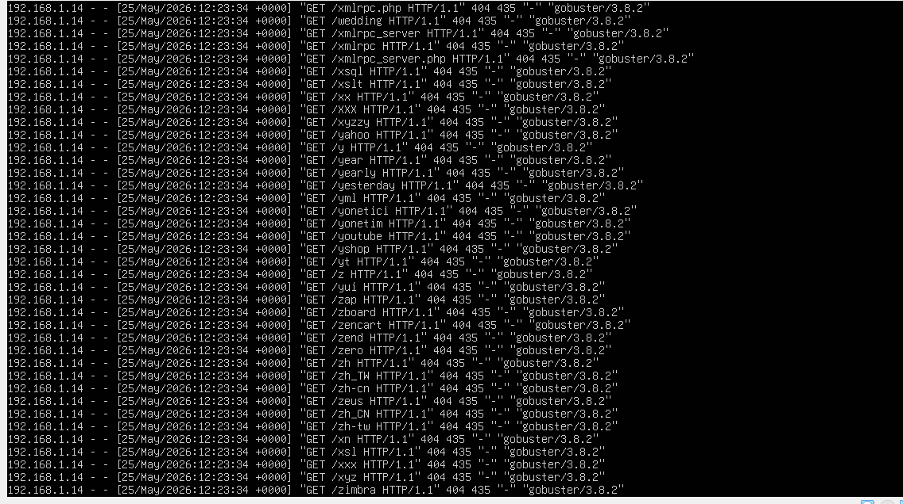

---

## 🔴 Detección de SQL Injection

Se detectan intentos de manipulación de parámetros mediante payloads maliciosos.

Ejemplo típico:

```
' OR 1=1--
```

Esto indica un intento de bypass de autenticación.


---

## 🔴 Detección de Path Traversal

Se identifican intentos de acceso a archivos sensibles del sistema:

```
../../etc/passwd
```

Esto representa un intento de acceso no autorizado al sistema operativo.


---

# 🧠 7. Fase de Análisis

## 📊 Análisis de Patrones

Se clasifican los logs según el tipo de actividad detectada:

- Reconocimiento
- Fuzzing automatizado
- Intentos de SQL Injection
- Intentos de Path Traversal

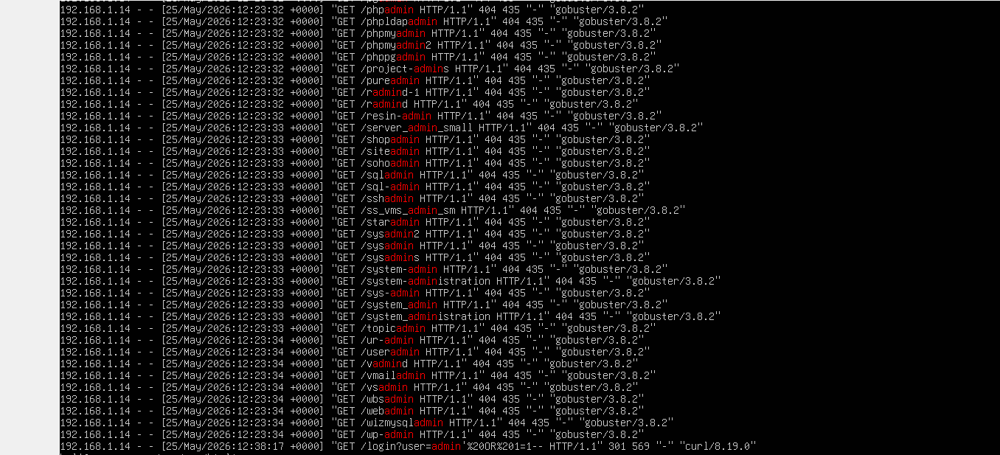

---

## 🧩 Correlación del Ataque

Se reconstruye la secuencia completa del incidente:

1. Reconocimiento de endpoints
2. Enumeración automatizada
3. Intentos de explotación

Esto permite entender el comportamiento del atacante.

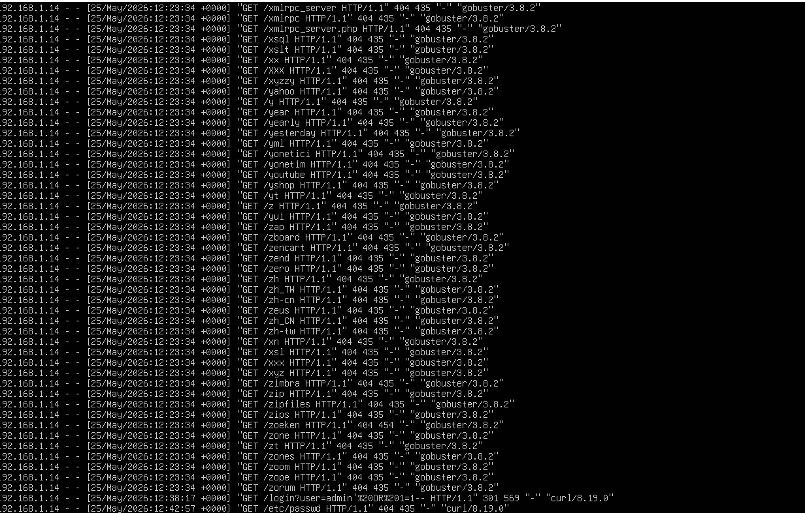

---

# 🚨 8. Fase de Respuesta

## 🛑 Contención del Ataque

Se bloquea la IP atacante mediante reglas de firewall:

```bash
sudo iptables -A INPUT -s <ATTACKER_IP> -j DROP
```

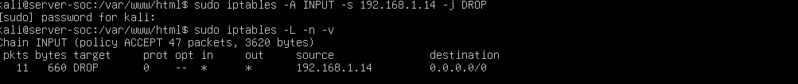

---

## 🔒 Verificación del Bloqueo

Se comprueba desde Kali que el acceso ya no es posible.

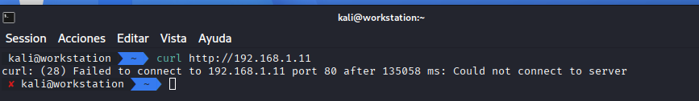

---

## 📊 Validación Post-Mitigación

Se analiza el comportamiento del tráfico tras aplicar la regla.

Resultado:

- Cese del tráfico malicioso
- Mitigación efectiva del incidente

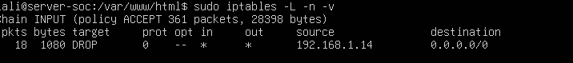

---

# 📊 Hallazgos

- Detección de reconocimiento de endpoints web
- Identificación de actividad automatizada (fuzzing)
- Intentos de explotación mediante SQL Injection
- Intentos de acceso a archivos sensibles (Path Traversal)
- Correlación completa del ataque
- Respuesta efectiva mediante firewall

---

# 🧠 Conclusiones

El comportamiento observado corresponde a un ataque web en múltiples fases:

1. Reconocimiento  
2. Enumeración  
3. Intentos de explotación  

Este laboratorio demuestra cómo un analista SOC puede detectar y analizar amenazas **sin necesidad de ver directamente el ataque**, únicamente mediante logs.

---

# 🛡️ Recomendaciones

- Implementar un WAF (Web Application Firewall)
- Integrar un SIEM (Wazuh, ELK)
- Configurar alertas por volumen de peticiones
- Automatizar bloqueos con Fail2ban
- Mejorar la monitorización y retención de logs

---

# 💼 Habilidades Demostradas

- Análisis de logs HTTP
- Detección de amenazas web
- Correlación de eventos
- Respuesta a incidentes
- Monitorización en tiempo real

---

# 🏁 Nota Final

Este proyecto representa un flujo completo de trabajo en un entorno SOC real:

👉 Detección  
👉 Análisis  
👉 Correlación  
👉 Respuesta  

Enfocado en evidencias y comportamiento, no en herramientas de ataque.
